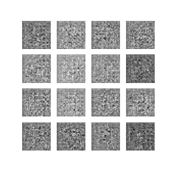

# Visual Finger Recognition with GANs

This repository contains the code for a project on visual finger recognition using Generative Adversarial Networks (GANs). Two GAN architectures, AC-GAN and W-GAN, were implemented and trained on a dataset of finger images.

## Introduction

The goal of this project is to explore the effectiveness of GANs in synthesizing realistic finger images for recognition purposes. Both AC-GAN and W-GAN were chosen to compare their performance in generating diverse and high-quality finger images.

## Algorithms
### AC-GAN
AC-GAN is an extension of the traditional GAN framework that incorporates both a generator and a discriminator. It introduces an auxiliary classifier within the discriminator to enforce class constraints on the generated samples. This helps in generating more diverse and class-conditioned samples.

### W-GAN
Wasserstein GAN is a GAN variant that utilizes Wasserstein distance as the training objective instead of the Jensen-Shannon divergence used in traditional GANs. W-GAN addresses some of the training instability issues present in standard GAN training and provides a more stable training process.

## Results

### AC-GAN training result

### W-GAN training result

## Comparison of AC-GAN and W-GAN

Both AC-GAN and W-GAN were implemented and trained for visual finger recognition in this project. Here's a comparison of their key characteristics:

### Training Stability

- AC-GAN: The inclusion of an auxiliary classifier within the discriminator helps in stabilizing the training process by enforcing class constraints on the generated samples.
- W-GAN: Wasserstein GANs typically offer better training stability compared to traditional GANs due to the use of Wasserstein distance as the training objective.

### Image Quality

- AC-GAN: Generates high-quality images with clear class conditioning, resulting in visually appealing finger images.
- W-GAN: While W-GANs also produce high-quality images, they may exhibit less explicit class conditioning compared to AC-GAN.

### Diversity of Generated Samples

- AC-GAN: The auxiliary classifier encourages the generation of diverse samples corresponding to different classes, resulting in a wider range of synthesized finger images.
- W-GAN: W-GANs may produce slightly less diverse samples compared to AC-GAN, but still demonstrate the ability to generate realistic finger images.

Overall, both AC-GAN and W-GAN show promising results for visual finger recognition, each with its own strengths and trade-offs.

## References
[1] `Odena, A., Olah, C., & Shlens, J. (2017). Conditional image synthesis with auxiliary classifier GANs. In Proceedings of the 34th International Conference on Machine Learning-Volume 70 (pp. 2642-2651). JMLR. org.`

[2] `Arjovsky, M., Chintala, S., & Bottou, L. (2017). Wasserstein GAN. arXiv preprint arXiv:1701.07875.`
